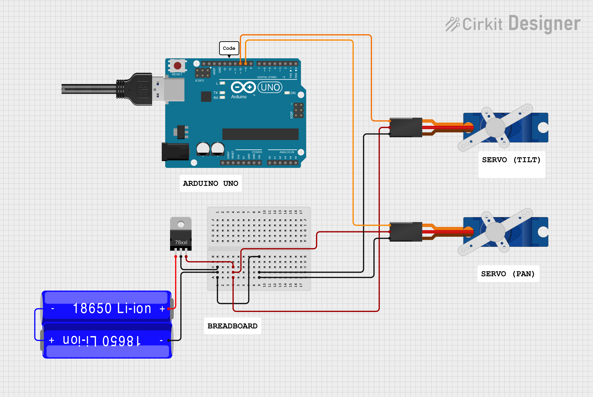

#Tracking Turret

Implements a **2-axis tracking turret** capable of following an object, a face, eye-gaze, or mouse pointer.
Uses **computer vision** with **servo control** to move a pan-tilt turret.

## Implementation

- **Face Tracking**: Uses OpenCV and Haar cascades to detect and track faces.
- **Eye-Gaze Tracking**: follow the direction of the eye-gaze.
- **Object Tracking**: Can track any colored or defined object in the camera frame.
- **Mouse Control**: follow mouse movement on screen.
- **Jersey Tracking**: We trained our own yolov8 model to track our college jersey.

## Hardware

- Pan-Tilt Turret with **two servo motors**
- Arduino board (Uno, Nano, or similar)
- USB/Serial connection to the controlling PC
- Camera

## How It Works

1. The camera captures frames in real-time.
2. OpenCV detects faces, objects, or eye-gaze direction.
3. Errors between the target and the center of the frame are calculated.
4. Python sends commands over serial to Arduino.
5. Arduino moves the pan-tilt servos according to the commands.

